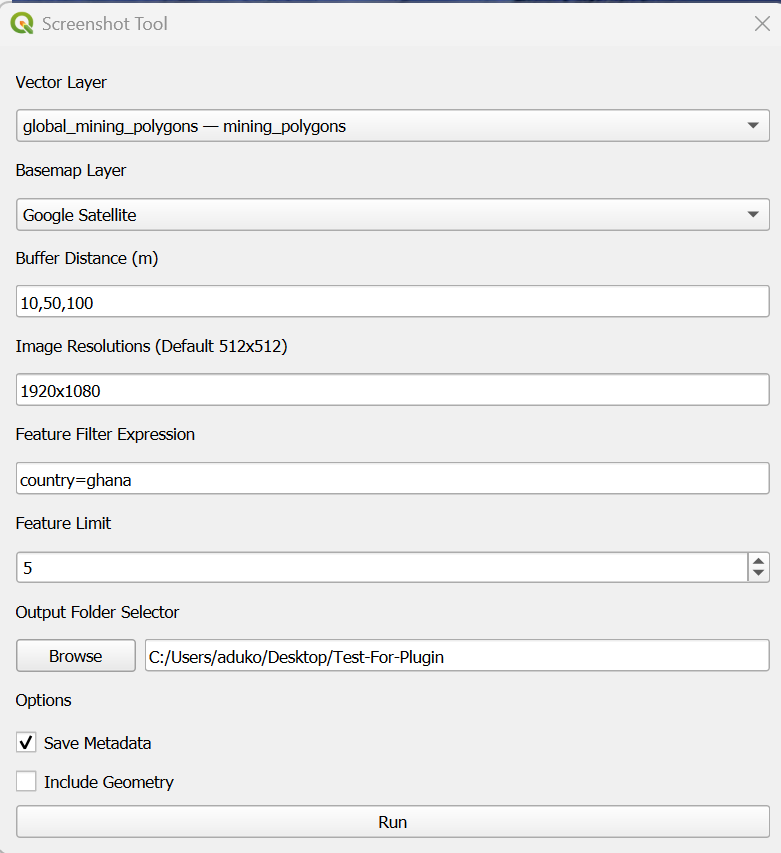

# [Watch/Download demo video](Plugin-Test-2.mp4)

# Screenshot Tool – QGIS Plugin


The Screenshot Tool lets you automatically capture map screenshots of vector features (points/polygons) at customizable buffer distances using any base layer. It's ideal for geospatial image datasets, country-based exports, or computer vision training data.

---

## Features

- Select **any vector layer** and **basemap layer**
- Choose multiple **buffer distances**
- Filter features by attributes like:
  ```
  country=ghana, status=active
  ```
- Set a **limit** on number of features to process
- Save screenshots to a chosen folder
- Optionally export:
  - CSV metadata (feature ID, coordinates, attributes)
  - Geometry in WKT format
- Set preferred **Image Resolutions**

---

## Install

### Option 1: Manual Installation

Clone this repository into your QGIS plugin folder:

**Windows**
```
C:\Users<your_username>\AppData\Roaming\QGIS\QGIS3\profiles\default\python\plugins\
```
**Linux/macOS**
```
~/.local/share/QGIS/QGIS3/profiles/default/python/plugins/
```
Then restart QGIS and enable the plugin from:  
`Plugins > Manage and Install Plugins`

---

### Option 2: Plugin Manager (if published)

1. Open QGIS
2. Go to `Plugins > Manage and Install Plugins`
3. Search for **Screenshot Tool**
4. Click **Install**

## How to Use

1. **Open the Plugin**
   - Go to `Plugins > Screenshot Tool > Open Screenshot Tool`

2. **Select Layers**
   - *Vector Layer*: e.g. mining polygons, site points
   - *Basemap Layer*: e.g. Google Satellite, OpenStreetMap

3. **Buffer Distance**
   - Comma-separated values in meters (buffer around each feature)
     ```
     50, 100, 250
     ```

4. **Image Resolutions**
   - Set preffered image resolutions. (512x512 by default)
     ```
     256x256
     ```

5. **Filter Features (optional)**
   - Use simple filters like:
     ```
     country=ghana
     status=active
     country=ghana, status=active
     ```

6. **Feature Limit (optional)**
   - Choose how many features to capture. Leave at 0 to capture all.

7. **Output Folder**
   - Browse to select where screenshots and metadata will be saved

8. **Export Options**
   -  Save Metadata → saves a CSV with `feature_id, lat, lon, attributes`
   -  Include Geometry → adds WKT geometry to metadata file

9. **Click "Run"**
   - Screenshots will be generated and saved to your output folder
   - Metadata CSV will be saved if selected

---


## Output Example

```
output_folder/
├── feature_5_100m.png
├── feature_5_250m.png
├── feature_6_100m.png
├── screenshot_metadata.csv
```

---

## Notes & Tips

- Ensure your vector layer has valid geometries
- Buffer distabces determine image framing (in meters)
- Works best with EPSG:4326 or project CRS-compatible layers
- Filtering is case-insensitive and auto-trimmed

---

## Troubleshooting

- **"0 features" message?** → Check your filter syntax or field name
- **Basemap doesn't appear?** → Confirm it's visible and in the QGIS canvas
- **Missing output?** → Ensure you selected an output folder and buffers
